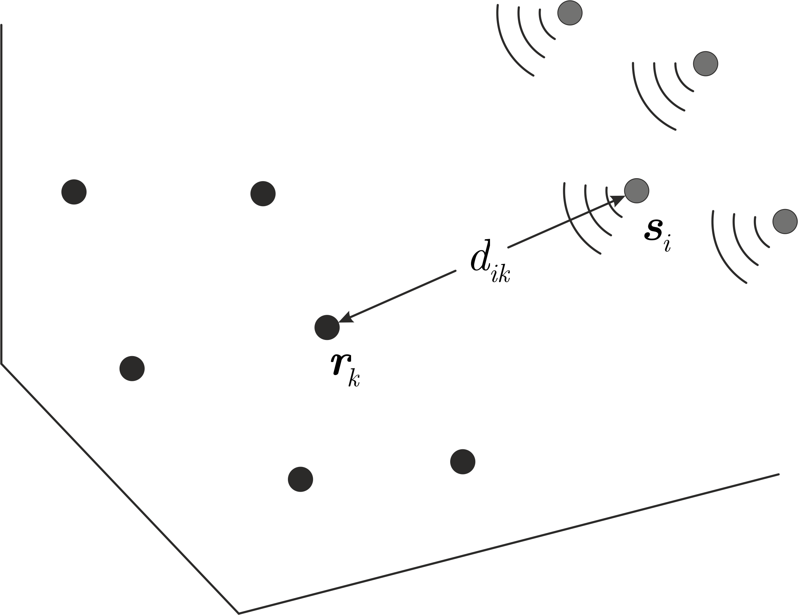

# Minimal Time-of-Arrival self-localization problems

The *m*-senders/*n*-receivers (*m*s/*n*r) Time-of-Arrival (ToA) self-localization problem involves determining the relative positions of $m$ senders $\mathbf s_i$ and $n$ receivers $\mathbf r_k$ in 2D or 3D space, given pairwise distance measurements $d_{ik}$ derived from signal propagation times.

  

  <em>Illustration of the 3D 4-senders / 6-receivers ToA self-localization problem</em>

A problem is considered *minimal* when it admits a finite (but non‑zero) number of solutions for generic distance measurements. This repository contains MATLAB solvers for the following minimal ToA problems:
* 2D 3s/3r
* 3D 4s/6r

The implementations have been tested on
* MATLAB R2019b

The solvers have been generated using the automatic solver generator from https://github.com/martyushev/eliminationTemplates

If you use this code, please cite:

@article{martyushev2026implicitization, 
&nbsp;&nbsp;&nbsp; title={An implicitization-based solution to the minimal 4s/6r ToA problem using Cayley--Menger determinants}, 
&nbsp;&nbsp;&nbsp; author={Martyushev, Evgeniy}, 
&nbsp;&nbsp;&nbsp; journal={http://arxiv.org/abs/2606.20840 }, 
&nbsp;&nbsp;&nbsp; volume={}, 
&nbsp;&nbsp;&nbsp; pages={}, 
&nbsp;&nbsp;&nbsp; year={2026} 
}